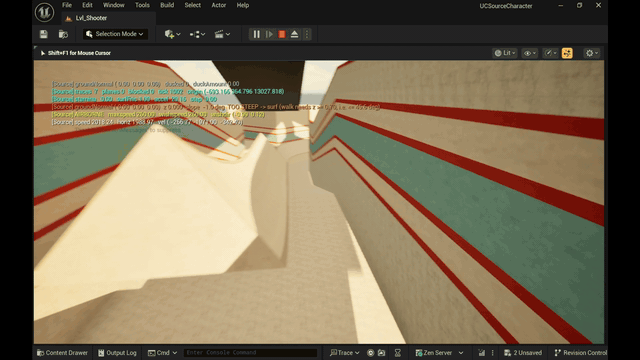
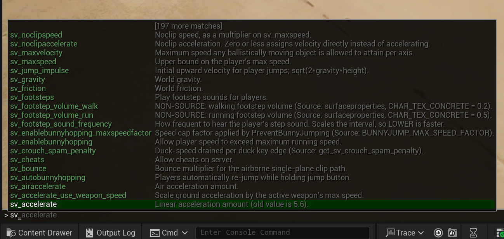

<h1 align=center>Source Movement для Unreal Engine 5</h1>

<div align=center>


[English](README.md) · **Русский**

</div>

<div align=center>

**Сюрф** — скольжение по плоскости круче предела ходимости и сохранение скорости на выходе



**Банихоп** — набор скорости стрейфом со снятым капом на прыжке


</div>


> **Поведенческая реплика** передвижения игрока из Counter-Strike: Global Offensive внутри
> Unreal Engine 5.6 — банихоп, эйрстрейф, сюрф, краучджампы, стамина и баги оригинального движка,
> воспроизведённые намеренно.

Это не «движение в стиле CS». Это построчный порт `CGameMovement` и `CCSGameMovement` из движка
Source, с сохранённым порядком операций, одинарной точностью и примерно **58 каталогизированными
кварками**. Где у Source баг — здесь такой же баг, с номером кварка и регрессионным тестом.

---

## Содержание

- [Почему не `UCharacterMovementComponent`](#почему-не-ucharactermovementcomponent)
- [Что работает](#что-работает)
- [Требования](#требования)
- [Быстрый старт](#быстрый-старт)
- [Архитектура](#архитектура)
- [Звук](#звук)
- [Консоль](#консоль)
- [Конфиги](#конфиги)
- [Импорт карт из CS2](#импорт-карт-из-cs2)
- [Отладка](#отладка)
- [Тесты](#тесты)
- [Расширение](#расширение)
- [Чего нет](#чего-нет)
- [Лицензия](#лицензия)
- [Благодарности](#благодарности)

---

## Почему не `UCharacterMovementComponent`

Движение Unreal и движение Source — это не один алгоритм с разными константами. Они расходятся в
том, что вообще считать реакцией на столкновение. Source скользит вдоль пяти плоскостей отсечения за
тик с жёстко зашитым выталкиванием на `DIST_EPSILON`; Unreal разлепляется через Chaos и имеет
собственную логику пола и ступеней. Если навесить числа CS на `UCharacterMovementComponent`,
получится нечто *примерно* похожее, которое ломается ровно на том, что игрокам важно: сюрф-рампы,
эджбаги, высота краучджампа.

Поэтому не используется ничего из этого. Из пути движения **намеренно исключены**:

| Не используется | Чем заменено |
|---|---|
| `ACharacter`, `UCharacterMovementComponent` | `ASourcePlayerPawn` + `USourceMovementComponent` |
| `UCapsuleComponent` | AABB-хал Source (32×32×72 стоя, 32×32×54 в присяде) |
| `SafeMoveUpdatedComponent`, `SlideAlongSurface`, `ComputeSlideVector`, `TwoWallAdjust` | `TryPlayerMove` + `ClipVelocity` (солвер на 4 отскока, `MAX_CLIP_PLANES = 5`) |
| `FindFloor`, `WalkableFloorAngle`, `StepUp`/`StepDown` | `CategorizePosition`, `TracePlayerBBoxForGround`, `StayOnGround`, `StepMove` |
| Гравитация / трение / ускорение UE | `sv_gravity`, `sv_friction`, `sv_accelerate`, `sv_airaccelerate` |

`USourceMovementComponent` наследуется от `UPawnMovementComponent` **только** ради обвязки
(привязка `UpdatedComponent`, `PawnOwner`, тик). Ни один хелпер движения из `UMovementComponent` не
вызывается.

---

## Что работает

<!-- Drop your feature GIFs here -->

**Движение**
- Ускорение и трение на земле с полом `control` на уровне `sv_stopspeed`
- Ускорение в воздухе с бюджетом 30 u/s — это и есть механизм эйрстрейфа
- Банихоп, `sv_autobunnyhopping` и лок скорости 1.1× из `PreventBunnyJumping`
- Сюрф: рампы круче предела ходимости проскальзываются, скорость сохраняется на выходе
- Прыжок со стоимостью по стамине, ground-фактором и правилом «присевший прыжок перезаписывает
  вертикальную скорость»
- Непрерывный присед CS:GO (`m_flDuckAmount`), краучджамп, штраф за спам приседа, проверка потолка
- Шаг вверх/вниз, `StayOnGround`, классификация земли по литеральному `normal.z >= 0.7`

**Системы вокруг**
- Фиксированная симуляция на 64 или 128 тик, независимая от FPS
- Настоящая консоль CS:GO: переменные `sv_*` / `cl_*` за гейтом `sv_cheats`, который на `0`
  *откатывает* значения
- `bind` / `unbind` / `bindlist` с именами клавиш Source и полным набором алиасов `+command`
- `exec` и `.cfg` файлы в папке `cfg/`, включая `autoexec.cfg`
- Шаги, прыжок и приземление по физическим материалам ([ассеты не входят в репозиторий](#звук))
- Коллизия с обычными коллайдерами Unreal через Chaos, плюс аналитический бэкенд для тестов

**Не реализовано** — см. [Чего нет](#чего-нет): вода, спектатор, сеть.

---

## Требования

- **Unreal Engine 5.6** (Win64)
- **Visual Studio 2022** с нагрузкой *Разработка игр на C++*
- Опционально, чтобы читать порт рядом с оригиналом: локальная копия
  [Kisak-Strike](https://github.com/SwagSoftware/Kisak-Strike). Каждая портированная функция несёт
  ссылку вида `file.cpp:line` в это дерево — в основном `game/shared/gamemovement.cpp` и
  `game/shared/cstrike15/cs_gamemovement.cpp`.

> [!NOTE]
> Физика **обязана** собираться с точной семантикой плавающей точки (MSVC `/fp:precise`).
> UnrealBuildTool не передаёт `/fp:fast`, пока таргет этого явно не попросит, так что по умолчанию всё
> правильно — но если в проекте включён fast math, golden-тесты начнут падать.
> Не «чинить» тесты — нужно исправить флаги. Это записано в начале `SourceMovement.Build.cs`.

---

## Быстрый старт

### 1. Сборка

```bash
Build_Editor.bat
```

`rebuild` — полная пересборка. Если движок стоит не по умолчанию, сначала задай `UE_ROOT`:

```bash
set UE_ROOT=D:\UE_5.6
```

> [!WARNING]
> Перед сборкой закройте редактор. Live Coding держит DLL модуля, и сборка откажется идти с ошибкой
> `Unable to build while Live Coding is active`.

### 2. Карты

Карты в комплект не входят. Геометрия из Workshop принадлежит её авторам и Valve, поэтому
`Content/maps/` исключена из системы контроля версий; пайплайн, которым она получается, описан в
разделе [Импорт карт из CS2](#импорт-карт-из-cs2).

Поэтому `EditorStartupMap` и `GameDefaultMap` указывают на `/Engine/Maps/Entry` — пустую карту,
которая есть в любой установке движка. Свежий клон открывается на пустом уровне: создайте или
импортируйте свой, затем переставьте оба пути в **Project Settings** → **Maps & Modes**.

Разработка велась на двух картах, по одной на дисциплину:

| Карта | Рекомендуемый путь | Что проверяет |
|---|---|---|
| `surf_utopia_njv` | `Content/maps/surf/` | Рампы круче предела ходимости. Контроль в воздухе, выходы с рампы, сохранение скорости |
| `bhop_emevaelx3` | `Content/maps/bhop/` | Плоские блоки и разрывы. Тайминг прыжка, набор через стрейф, кап `PreventBunnyJumping` |

Импортированной карте нужен **PlayerStart** и **GameMode Override**, выставленный в
`SourceMovementGameModeBase`, как описано в следующем разделе.

Сюрф и банихоп рассчитаны на недефолтные настройки консоли; под каждый уровень есть пресет, описанный
в разделе [Конфиги](#конфиги):

```
exec surf
```

### 3. Настройка уровня

1. Поставь **PlayerStart** туда, где должен появляться игрок.
2. **World Settings** → **Game Mode** → **GameMode Override** → **`SourceMovementGameModeBase`**.
   Он сам заспавнит `ASourcePlayerPawn`.
3. Дай уровню геометрию с коллизией, блокирующей канал `Pawn`. Всё, что блокирует `ECC_Pawn`,
   блокирует игрока — никаких настроек, своих каналов и дополнительных компонентов.
4. Жми Play.

Это вся настройка. `W A S D`, `SPACE`, `CTRL`, `SHIFT` и мышь работают сразу.

> [!IMPORTANT]
> **Масштаб.** `SourceUnits::UnitsToUU` равен `1.0`, то есть **1 юнит Source = 1 юнит Unreal**, и
> игрок **72 UU в высоту** — примерно треть от стандартного манекена UE в 180 см. Геометрию уровней
> необходимо авторить в масштабе Source, иначе игрок будет выглядеть очень маленьким относительно
> уровня. Поэтому sample-уровни выглядят мелкими рядом со стартовым контентом Unreal.
>
> Чтобы юниты Source соответствовали сантиметрам, измените эту одну константу на `2.54`.
> Это намеренно единственный коэффициент пересчёта в проекте — разбросанных множителей нет.

### 4. Проверка

Откройте консоль (`` ` `` или `~`):

```
sv_cheats 1
cl_showpos 2
```

Теперь на экране живая сводка: скорость, состояние земли, направление желания, стамина, трение,
количество трейсов и нормаль земли с углом наклона.

---

## Архитектура

Главное правило всей кодовой базы:

> **Симуляция ничего не знает про Unreal.**
> `FSourceMovementSim::ProcessMovement` — чистая функция от
> `(state, movedata, params, world, frametime)`. Ни `UObject`, ни `AActor`, ни `UWorld`.
> Именно это делает её детерминированной, реплеябельной и тестируемой без PIE — и именно это
> понадобится сетевому слою.

### Слои

```
┌─ Unreal ────────────────────────────────────────────────────────────────┐
│  ASourcePlayerPawn            камера, бинды клавиш, обновление вида     │
│  USourceMovementComponent     фикс. шаг, снимок CVar, публикация трансф.│
│  USourceMovementAudioComponent  играет то, что решила симуляция         │
│  USourceHullComponent         прокси AABB только для запросов           │
│  USourceLocalPlayer           перехватывает `exec` раньше движка        │
└────────────────────────────┬────────────────────────────────────────────┘
                             │  FSourceInputState / FSourceMovementState
                             │  FSourceMovementParams / FSourceMovementEvents
┌────────────────────────────▼────────────────────────────────────────────┐
│  FSourceMovementSim           САМ ПОРТ. Ни одного типа UE. 4000 строк.  │
│    _Move        трение, ускорение, walk/air move, прыжок, стамина       │
│    _Collision   TryPlayerMove, ClipVelocity, StepMove, CategorizePos    │
│    _Duck        непрерывный автомат приседа CS:GO                       │
│    _Audio       UpdateStepSound — решает, но никогда не играет          │
└────────────────────────────┬────────────────────────────────────────────┘
                             │  ISourceWorldQuery  (только FSourceTraceResult)
┌────────────────────────────▼────────────────────────────────────────────┐
│  FSourceWorldQuery_UE        свипы Chaos по реальной коллизии уровня    │
│  FSourceWorldQuery_Analytic  brush-мир; эталонная реализация            │
└─────────────────────────────────────────────────────────────────────────┘
```

Код движения никогда не видит `FHitResult` — только `FSourceTraceResult`. Эта абстракция не
украшение: она позволяет одному и тому же солверу работать против Chaos в игре и против точного
аналитического brush-мира в тестах, и именно так валидируется бэкенд на Chaos.

### Карта файлов

| Путь | Что там |
|---|---|
| `Core/SourceScalar.h` | `srcfloat`, `FastSqrt`, `SinCos` — контракт по float |
| `Core/SourceVector.h`, `SourceAngles.h` | `FSrcVec3`, `FSrcAngles`, вербатим `AngleVectors` / `VectorNormalize` |
| `Core/SourceMovementState.h` | `FSourceMovementState`, `FSourceMoveData`, `FSourceMovementEvents`, телеметрия |
| `Core/SourceMovementParams.h` | Все физические константы, каждая со ссылкой на строку Source |
| `Core/SourceMovementSim.*` | Сам порт, разбит на пять `.cpp` по подсистемам |
| `Core/ISourceWorldQuery.h` | Абстракция трассировки |
| `World/SourceWorldQuery_UE.*` | Бэкенд Chaos — восстанавливает плоскостную математику Source из свипов |
| `World/SourceWorldQuery_Analytic.*` | Порт `CM_ClipBoxToBrush`; точный, используется как оракул |
| `Input/SourceKButton.h` | `kbutton_t` с дробным `KeyState()` (0 / 0.25 / 0.5 / 0.75 / 1) |
| `Input/SourceBindManager.*` | `bind`, `exec`, конфиги, таблица алиасов `+command` |
| `Actors/*` | Оболочка со стороны Unreal |
| `SourceMovementCVars.*` | Все 40 консольных переменных и гейт `sv_cheats` |
| `SourceUnits.h` | **Единственное** место, где пересчитываются юниты и переворачивается ось Y |

### Два инварианта, которые стоит знать до правок

**Шаг времени.** Одна `FSourceUserCmd` — один тик, всегда `1/TickRateHz`, никогда не дельта кадра.
Компонент копит реальное время и прогоняет целые шаги. Ввод сэмплируется **на шаг, а не на кадр**,
потому что `KeyState()` съедает импульсные биты: сэмплинг на кадр превратил бы клавишу, нажатую
посреди кадра, в полное нажатие, и реплей разошёлся бы.

**Поворот корня.** `UpdatedComponent` держится выровненным по осям; ориентация игрока живёт только в
`State.ViewAngles`. Камера — дочерний компонент, поэтому любой поворот, оставленный на корне,
применился бы к виду второй раз — а солвер и так метает AABB, выровненный по мировым осям и
игнорирующий поворот актора. Меш тела, который должен смотреть по виду, вешается на **дочерний**
компонент.

---

## Звук

В репозитории нет аудио-ассетов. Звуки, на которых велась разработка, принадлежат Valve и
исключены из системы контроля версий, поэтому свежий клон даёт полностью рабочее движение без звука.
Первый шаг, который должен был прозвучать, пишет в лог строку с именем недостающего ассета.

Движение от звука не зависит никак: отсоединение аудио-компонента физику не меняет.

Оригинальные звуки CS2 извлекаются
[Source 2 Viewer](https://github.com/ValveResourceFormat/ValveResourceFormat) — тем же инструментом,
что и геометрия карт в разделе [Импорт карт из CS2](#импорт-карт-из-cs2). Шаги игрока, приземления и
звук прыжка лежат в `sounds/player/` внутри VPK-архивов игры; набор бетона с префиксом `ct_` — это
то, что ожидают пути по умолчанию ниже.

### Как устроено разделение

**Симуляция решает, когда звук происходит**; компонент только проигрывает. Это не произвольное
разделение слоёв: каденс шагов в CS — тиковое состояние (`m_flStepSoundTime` убывает в миллисекундах
по `frametime`), и решение на кадровом тике сделало бы частоту шагов зависимой от FPS, чего в CS нет.

```
FSourceMovementSim  ──► FSourceMovementEvents ──► USourceMovementAudioComponent
   UpdateStepSound        bStepSound                выбирает клип, играет
   CheckJumpButton        bJumpSound
   OnLand                 bLandSound
```

События вычитываются **раз на шаг симуляции**, не на кадр: при 128 тик в один кадр попадает два шага.

### Подключение своих звуков

1. Импортируй волны куда угодно в `Content/`.
2. Выбери пешку игрока, затем её компонент **`MovementAudio`**.
3. Заполни **`Default Sounds`**:

   | Поле | Что ожидает |
   |---|---|
   | `Footsteps` | Массив вариантов шага. В CS их 17 на поверхность; подойдёт любое число, хоть один |
   | `Land` | Звуки приземления, выбираются случайно |
   | `Jump Launch` | Один клип, `Default.WalkJump` из Source |

4. По желанию задай **`Surf Wind Loop`**. Волна обязана быть помечена **Looping** или обёрнута в
   зацикленный Sound Cue — компонент пишет предупреждение, если это не так, потому что ветер,
   прозвучавший один раз, неотличим от отсутствующего ассета.

Клипы выбираются случайно с защитой от немедленного повтора, так что двух одинаковых шагов подряд
не будет.

### Звуки по поверхностям

Поверхности различаются по **`EPhysicalSurface`** — это ближайший аналог `surfaceproperties.txt`
из Source:

1. **Project Settings → Physics → Physical Surfaces** — назови тип поверхности, например `Metal`.
2. Создай **Physical Material** и выставь ему **Surface Type**.
3. Назначь этот Physical Material материалу поверхности.
4. В аудио-компоненте добавьтете запись в **`Surface Sounds`** для этого типа.

Всё без Physical Material попадает в `SurfaceType_Default` и откатывается к `Default Sounds`.

> [!NOTE]
> Идентификатор поверхности — это значение `EPhysicalSurface`, намеренно **не** `GetUniqueID()`
> ассета. UniqueID стабилен только внутри одного процесса, против него таблицу авторить невозможно
> в принципе.

### Пути по умолчанию

В компоненте уже прописаны soft-пути на раскладку, использовавшуюся при разработке. Разместите ассеты по
этим путям — всё подключится само; положи в другое место — назначай руками.

```
Content/sounds/player/footsteps/concrete/concrete_ct_01 … concrete_ct_17
Content/sounds/player/land/concrete/land, land2, land3, land4
Content/sounds/player/land/concrete/jump_launch_01
Content/sounds/player/surf/slow_wind_lp_a_02
```

Неразрешённые soft-пути безвредны — грузятся в null, звук пропускается.

### Когда звуки реально срабатывают

Портировано из `CCSPlayer::UpdateStepSound` поверх `CBasePlayer::UpdateStepSound`, так что правила
именно CS, а не общие:

| Правило | Значение |
|---|---|
| **Ходьба полностью беззвучна** | `+speed` / `SHIFT` подавляет шаги на любой скорости |
| Минимальная слышимая скорость | `260 × 0.52 = 135.2` u/s, строится из константы — `sv_maxspeed` её не двигает |
| Интервал шага | 300 мс бегом, 400 мс шагом, × `sv_footstep_sound_frequency`, +100 мс в присяде |
| Присед | Громкость × 0.65 |
| Прыжок | Клип взлёта плюс форсированный шаг на полной громкости выше 126 u/s |
| Приземление | Только выше **270 u/s** скорости падения, затем land-клип плюс шаг поверхности |

Защёлка ходьбы **гистерезисная**: нажатие `SHIFT` на полном бегу не затыкает мгновенно, игрок
остаётся слышимым, пока не затормозит до 25 u/s от walk-кэпа. Это поведение Source, а не баг.

### Микс

| Где | Что |
|---|---|
| `sv_footstep_volume_walk` / `_run` | Кормят собственный `fvol` симуляции (0.2 / 0.5 на бетоне) |
| `sv_footstep_sound_frequency` | Масштаб интервала — **меньше значит чаще** |
| `sv_footsteps 0` | Выключить полностью |
| Компонент: `Footstep`/`Land`/`Jump VolumeScale` | Чистые множители микса. Если надо просто громче — сюда |
| Компонент: `Land Velocity For Full Volume` | Громкость приземления нарастает от порога 270 u/s до этого значения |
| Компонент: `Surf Wind Speed Range`, `Volume Scale` | Ветровая подложка по скорости |

---

## Консоль

Консоль открывается на `` ` `` или `~`.

### Гейт читов

```
sv_cheats 1
```

Почти все `sv_*` и `cl_*` здесь под гейтом. При `sv_cheats 0` запись отклоняется с собственным
сообщением Source, а возврат в `0` — как и в Source — **откатывает каждую изменённую переменную к
значению по умолчанию**, а не просто блокирует дальнейшие изменения.

> [!NOTE]
> Это намеренное расхождение. В настоящей CS:GO большинство переменных движения —
> `FCVAR_NOTIFY|FCVAR_REPLICATED`, но **не** защищены читами. Каждое объявление в
> `SourceMovementCVars.cpp` хранит настоящие флаги Source, так что вернуть точный гейтинг — правка
> одной таблицы.

### Переменные



<details><summary>Все консольные переменные, со значениями по умолчанию</summary>

**Физика**

| Переменная | Дефолт | Примечание |
|---|---|---|
| `sv_gravity` | 800 | |
| `sv_friction` | 5.2 | |
| `sv_stopspeed` | 80 | Пол для члена `control` в трении |
| `sv_accelerate` | 5.5 | |
| `sv_airaccelerate` | 12 | **Главная ручка сюрфа.** На сюрф-серверах 100–800 |
| `sv_maxspeed` | 320 | Верхняя граница; на практике не выше `CS_PLAYER_SPEED_RUN` |
| `sv_maxvelocity` | 3500 | Клэмп **по осям**, не по модулю |
| `sv_stepsize` | 18 | |
| `sv_bounce` | 0 | |
| `sv_jump_impulse` | 301.993377 | `sqrt(2 · g · h)` |
| `sv_staminajumpcost` | 0.08 | |
| `sv_staminalandcost` | 0.05 | |
| `sv_staminarecoveryrate` | 60 | Применяется в `ReduceTimers` **до** того, как прыжок читает стамину |
| `sv_staminamax` | 80 | Это не то же самое, что `STAMINA_RANGE`, равный 100 |
| `sv_timebetweenducks` | 0.4 | |
| `sv_crouch_spam_penalty` | 2.0 | |
| `sv_rollangle` / `sv_rollspeed` | 0 / 200 | |

**Переключатели поведения**

| Переменная | Дефолт | Примечание |
|---|---|---|
| `sv_enablebunnyhopping` | 0 | `1` убирает `PreventBunnyJumping` — матчмейкинговый лок скорости |
| `sv_autobunnyhopping` | 0 | `1` перепрыгивает при зажатом прыжке. **Независим от предыдущего** |
| `sv_enablebunnyhopping_maxspeedfactor` | 1.1 | Коэффициент кэпа: 1.1 × 260 = 286 u/s |
| `sv_accelerate_use_weapon_speed` | 1 | |
| `sv_optimizedmovement` | 1 | Пропускает ведущий `CategorizePosition` для идущих игроков |

**Звук**

| Переменная | Дефолт | Примечание |
|---|---|---|
| `sv_footsteps` | 1 | |
| `sv_footstep_sound_frequency` | 0.97 | Масштабирует интервал, то есть **меньше значит чаще** |
| `sv_footstep_volume_walk` / `_run` | 0.2 / 0.5 | Не из Source; замена отсутствующей таблице поверхностей |

**Клиент**

| Переменная | Дефолт | Примечание |
|---|---|---|
| `cl_forwardspeed` / `cl_sidespeed` / `cl_backspeed` | 450 | |
| `cl_upspeed` | 320 | |
| `cl_pitchdown` / `cl_pitchup` | 89 | |
| `sensitivity` | 2.5 | |
| `m_yaw` / `m_pitch` | 0.022 | Градусов на счётчик мыши |
| `cl_showpos` | 0 | `1` базовое, `2` добавляет трение, трейсы, плоскости, нормаль земли |
| `cl_sourcemove_drawhull` | 0 | Рисует AABB, который реально метается |
| `cl_sourcemove_drawtraces` | 0 | `1` только попадания, `2` каждый свип |

</details>

### Бинды

Синтаксис Source, имена клавиш Source:

```
bind "z" "+jump"
bind "MOUSE4" "+duck"
bind "SPACE" "+jump; +duck"
bind "p" "cl_showpos 1"
```

Бинд всегда называет только половину с `+` — движок синтезирует `-jump` на отпускании, ровно как
Source. Всё, что не начинается с `+`, — обычная команда и срабатывает только на нажатие. Точки с
запятой разделяют несколько команд.

Имена клавиш взяты из CS (`SPACE`, `CTRL`, `MOUSE1`, `MWHEELUP`, `UPARROW`, `KP_END`, …), поэтому
вставленный конфиг из настоящей CS:GO разрешится. Имена клавиш Unreal работают как запасной вариант.

> [!TIP]
> **Колёсико работает** — это то, что нужно для скролл-бхопа: `bind "MWHEELUP" "+jump"`.
> У щелчка колёсика нет фазы удержания, нажатие и отпускание попадают в один кадр, поэтому бит
> кнопки берётся из `state & 3` Source (нажата *или* была нажата в этом кадре), а не из одного лишь
> бита удержания. Один щелчок даёт ровно одну команду прыжка.

| Команда | Действие |
|---|---|
| `bind <key> <cmd>` | Привязать. Без `<cmd>` печатает текущую привязку |
| `unbind <key>` / `unbindall` | Снять |
| `bindlist` / `key_listboundkeys` | Напечатать все |
| `bind_defaults` | Вернуть дефолты CS:GO |
| `noclip` | Переключить ноуклип на текущей пешке. За гейтом читов |
| `exec <file>` | Выполнить конфиг из `cfg/` |
| `host_writeconfig [file]` | Сохранить бинды и изменённые переменные |
| `echo <text>` | Печать (в Source есть, в Unreal нет) |

Дефолты: `W A S D` движение, `SPACE` прыжок, `CTRL` присед, `SHIFT` ходьба, `TAB` таблица.
Оружейные и «использовать» команды (`+attack`, `+use`, `+reload`) не реализованы — это порт движения.

> [!NOTE]
> `exec` не может быть обычной консольной командой. `ULocalPlayer::Exec` забирает это имя себе
> раньше, чем дело доходит до `IConsoleManager`, и переписывает путь на `../../Binaries/`.
> `USourceLocalPlayer` перехватывает уровнем выше — только ради этого он и существует.

---

## Конфиги

Конфиги лежат в `<Project>/cfg/`, как в CS:GO, и с тем же синтаксисом: одна команда на строку,
комментарии `//`, аргументы в кавычках.

| Файл | Роль |
|---|---|
| `autoexec.cfg` | **Твой.** Выполняется последним при старте, никогда не перезаписывается. Шаблон с комментариями создаётся при первом запуске |
| `config.cfg` | Генерируется `host_writeconfig` и при выходе. Руками не править |
| `surf.cfg` | Сюрф — высокий контроль в воздухе, банихоп разблокирован |
| `bhop.cfg` | Банихоп — автохоп, без капа скорости, без стамины |
| `kz.cfg` | KZ / климб — без стамины, без капа, прыжок таймится руками |
| `csgo.cfg` | Возврат к матчмейкинговым дефолтам |

Порядок при старте: сначала `config.cfg`, потом `autoexec.cfg` — то есть написанное руками всегда
побеждает.

### Сюрф

```
exec surf
```

Вылет с рампы **эмерджентен** — он следует из `TryPlayerMove` и `ClipVelocity` и не требует
отдельного кода. Мешает на матчмейкинговых настройках `sv_airaccelerate 12`: при таком контроле в
воздухе ты просто не набираешь скорость, ради которой выход с рампы игрока подбрасывает. Пресет ставит
800 и снимает лок банихопа.

> [!IMPORTANT]
> Рампа сюрфится, только если она **круче 45.573°**. Этот порог — литеральный `normal.z >= 0.7` из
> `gamemovement.cpp:4229`, он не настраивается ни в Source, ни здесь. Более пологие рампы — это пол,
> по ним игрок просто пойдёт. Проверяется через `cl_showpos 1`, который печатает нормаль земли и
> угол наклона.

---

### KZ и банихоп

```
exec kz
exec bhop
```

Оба выключают **стамину** (`sv_staminamax 0`) — это то единственное изменение, без которого
многократные прыжки вообще не работают: с матчмейкинговой стаминой каждый следующий прыжок ниже
предыдущего, и цепочка умирает через несколько хопов. Оба также ставят `sv_enablebunnyhopping 1`,
снимая кап 286 u/s, который иначе применяется в момент отрыва от земли.

Отличаются ровно в двух местах: в `kz.cfg` остаётся `sv_autobunnyhopping 0`, чтобы прыжок таймился
руками, и стоит `sv_airaccelerate 100` вместо 1000.

> [!IMPORTANT]
> **Импорт KZ-карты из воркшопа.** Юниты Hammer — это и есть юниты Source, а `UnitsToUU` равен
> `1.0`, поэтому геометрия, перенесённая **в масштабе 1:1, уже правильная** — её не надо
> пересчитывать. Если пайплайн импорта переведёт в сантиметры, карта окажется в 2.54 раза больше
> игрока, и ни один разрыв не перепрыгнуть, при том что выглядеть всё будет нормально.
>
> Лестницы не реализованы, поэтому KZ-карту с обязательным залазом по лестнице не пройти.

---

## Импорт карт из CS2

Карт в репозитории нет -- surf и KZ, на которых всё проверялось, принадлежат авторам из Workshop и
Valve. Ниже пайплайн, которым их приносили, включая неочевидные места.

### Экспорт

CS2 -- это Source 2, файлы скомпилированы (`.vmap_c`, `.vmdl_c`), Hammer их не откроет. Нужен
[Source 2 Viewer](https://valveresourceformat.github.io/). Карты из Workshop лежат в
`steamapps/workshop/content/730/<id>/`; рядом с `.vpk` есть `publish_data.txt` с названием карты --
по нему и различаются числовые папки.

```bash
Source2Viewer-CLI.exe -i "<id>_dir.vpk" -o "exported/" -d --gltf_export_materials
```

Формат -- **`gltf`, не `glb`**: у GLB лимит 2 ГБ по спецификации, карты в него не влезают.

### Масштаб

Геометрия экспортируется в **сырых юнитах Source**, а `UnitsToUU` равен `1.0`, поэтому правильный
масштаб импорта -- **1:1**. Но glTF по спецификации в метрах, и импортёр может услужливо умножить
на 100.

Проверяйте масштаб по фактической высоте: разместите рядом `ASourcePlayerPawn` высотой 72 юнита. Если карта выглядит
стадионом -- это и есть пересчёт в метры.

### Коллизия

Автогенерация коллизии в Unreal создаёт выпуклые примитивы. Сюрф-рампа вогнутая и наклонная,
никакой выпуклый хал её не описывает, поэтому сгенерированная коллизия — это ящик вокруг всего чанка,
и игрок едет по нему, а не по рампе. В редакторе меша это видно как `Num Collision Primitives: 1`.

Импортированная геометрия карт поэтому использует треугольную сетку напрямую:

1. Выделить импортированные меши в Content Browser.
2. **Asset Actions → Bulk Edit via Property Matrix**.
3. **Collision Complexity** = `Use Complex Collision As Simple`.

Треугольная сетка становится simple-коллизией, и свипы солвера — они идут с `bTraceComplex = false` —
разрешаются по настоящей поверхности рампы. Сам `bTraceComplex` остаётся без изменений.

Выключенный **Auto Generate Collision** в опциях импорта избавляет от создания халов изначально.

> [!NOTE]
> Файл `_physics` — это не мировая коллизия. В Source 2 физическая сетка отдельная, из-за чего
> выглядит подходящим источником коллизии, но на `surf_utopia_njv` в ней оказались только объёмы
> энтити: 75 `trigger_teleport`, 5 `trigger_multiple`, 3 `func_water` и 2 `post_processing_volume`.
> Коллизию несут визуальные меши.
>
> Файл всё равно стоит сохранить: эти телепорты — переходы между стейджами, и без них карта не заработает
> как настоящая surf-карта, останется просто поверхностью для катания.

Нескольким классам мешей нужен **No Collision**, иначе они становятся невидимыми препятствиями:
прокси теней (`*_shadow`), светящиеся диски неба (`sun_disc_glow`) и поверхности воды
(`fancy_water`). Обычно это один-два треугольника с габаритом в сотни юнитов.

### Швы

Карта приезжает десятками отдельных мешей. Вершины у них сварены — на `surf_utopia_njv` соседние
чанки делят сотни точно совпадающих координат, — но каждый меш остаётся отдельным компонентом
коллизии, и свип при переходе с одного на другой может вернуть нормаль ребра вместо нормали грани.
Симптом: во время сюрфа периодически возникает зацеп на стыке.

**Tools → Merge Actors** на геометрии рампы убирает причину: у одного меша нет межмешевых рёбер, а
внутренние рёбра одной триангуляции Chaos разрешает заметно надёжнее. Это первое, что стоит
исключить при появлении зацепа на стыке.

### Что не переносится

Триггеры, телепорты, зоны старта и финиша и вообще все энтити -- это игровая логика, а не
геометрия. glTF её не несёт.

---

## Отладка

| Команда | Что показывает |
|---|---|
| `cl_showpos 1` | Скорость, состояние земли, направление желания, нормаль земли и угол |
| `cl_showpos 2` | Плюс стамина, трение, число трейсов, плоскости столкновения |
| `cl_sourcemove_drawhull 1` | AABB, который солвер реально метает — не меш, а настоящий хал |
| `cl_sourcemove_drawtraces 1` | Свипы с попаданием |
| `cl_sourcemove_drawtraces 2` | Все свипы, включая промахи |
| `cl_sourcemove_tracelog 1` | Печатает восстановление плоскости, когда свип блокируется с нулевым продвижением — подпись игрока, зажатого кривой коллизией |

Всё требует `sv_cheats 1`.

`USourceHullComponent` — **прокси только для запросов**. Он существует, чтобы другим системам было
во что попадать; солвер его не читает. Если нарисованный хал и прокси разойдутся — верь
нарисованному.

---

## Тесты

```bash
Run_SourceMovement_Tests.bat
```

67 автоматических тестов, все детерминированные и **без `UWorld`** — мир собирается из аналитических
brush'ей, а симуляция это обычный объект, так что они гоняются headless и дают побитово одинаковый
результат на любой машине.

| Группа | Что покрывает |
|---|---|
| `Math.*` | `VectorNormalize`, `AngleVectors` против посчитанных руками значений |
| `Friction.*`, `GroundAccel.*`, `AirAccel.*` | Скорость в замкнутой форме на обоих тикрейтах |
| `Jump.*`, `SpeedLock.*` | Стамина, лок пого, `PreventBunnyJumping` |
| `Duck.*` | Весь автомат приседа, геометрия краучджампа, штраф за спам |
| `Footsteps.*` | Каденс, правило тишины на `+speed`, порог 135.2 u/s |
| `View.*` | Yaw вида применяется ровно один раз через все три слоя |
| `KButton.*` | Бит удержания против импульсных — правило, благодаря которому работают бинды на колёсико |
| `ClipVelocity.*`, `Ground.*`, `WalkMove.*` | Реакция на столкновение и оседание на землю |
| `Seam.*` | Переход через стык двух брашей пола — не пришпиливает, нет застрявших тиков |
| `NoClip.*` | Пролёт сквозь солид, отсутствие гравитации, обе неположительные ветки ускорения |
| `Determinism.*`, `Invariants.*` | Одинаковый ввод → одинаковый результат; не в солиде, скорость ограничена |

Ожидаемые значения **выведены из кода Source**, а не замерены с этой реализации. В этом весь смысл:
тест, записавший то, что код делает сейчас, не способен обнаружить ошибку порта. Если тест упал —
сначала прочитайтете вывод в комментарии теста, а затем меняйтете число.

---

## Расширение

Честный ответ, разделённый надвое.

### Вокруг симуляции — легко

Каждая интересная граница — настоящий шов:

| Что нужно | Что сделать |
|---|---|
| Другая коллизия | Реализовать `ISourceWorldQuery` (7 чистых виртуалок). Две реализации есть как образец |
| Enhanced Input | Присвоить `USourceMovementComponent::InputProvider` — это `TFunction`. Пешку менять не надо |
| Реакция на прыжки/шаги/приземления | Подписаться на `USourceMovementComponent::OnMovementEvents` |
| Новая консольная переменная | Три строки в `SourceMovementCVars.cpp`: объявление, `Gate()`, `ApplyToParams` |
| Новый алиас `+command` | Одна строка в `RegisterButtons` |
| Новая консольная команда | Ветка в `ExecuteCommand` и вызов `RegisterVerb` |
| Звуки для поверхности | Только данные. Назначить Physical Material, добавить запись в `SurfaceSounds` |
| Новый тест | ~20 строк на `FSourceTestFixture` |

### Внутри симуляции — намеренно трудно

`FSourceMovementSim` — около 4000 строк, **ноль виртуальных функций**, ни хуков, ни
policy-объектов. Унаследоваться и переопределить поведение нельзя, и это сделано специально: каждая
точка расширения в вербатим-порте — место, где кто-то незаметно разойдётся с оригиналом, и
golden-тесты перестанут что-либо значить.

Поменять движение = **править сам порт**, а для этого сначала прочитать оригинал. Каждая функция
несёт ссылку `file.cpp:line`, чтобы можно было сравнить построчно. Закладывайся на это — такова
реальная цена решения, и покупает она симуляцию, доказуемо совпадающую с CS:GO.

Если нужны правки движения под свою игру, предусмотренный путь — **новая консольная переменная** в
`FSourceMovementParams`, а не наследник.

---

## Чего нет

Сказано прямо, чтобы никто не выяснял это тяжёлым путём.

| Пробел | Состояние |
|---|---|
| **Сеть / клиентское предсказание** | **Не реализовано.** Структуры к этому готовы — чистая функция симуляции, POD-состояние, одна команда на тик — но предсказания, сверки и отката нет |
| Вода (`CheckWater`, `WaterMove`, `WaterJump`) | Заглушка. Места вызова на местах, помечены `PHASE 7` |
| Спектатор, toss move | Заглушка |
| `CheckStuck` | Не портирован (таблица дрожания на 54 элемента) |
| Движущиеся платформы / `baseVelocity` | Не реализовано |
| Touch list | Не реализован |
| Рёбра между мешами коллизии | Бэкенд Chaos восстанавливает по одной контактной плоскости на свип, тогда как `CM_ClipBoxToBrush` берёт максимум по всему брашу. Свип на переходе между двумя мешами может подхватить нормаль ребра. Смягчено в бэкенде, полностью убирается слиянием геометрии -- см. [Импорт карт из CS2](#импорт-карт-из-cs2) |
| Таблица свойств поверхностей | Пустая. Поверхности различаются **звуком**, но делят трение и jump factor (`UNKNOWN-2`) |
| Урон от падения | Отложен — это правила игры, не движение |

Девять значений не выводятся из предоставленного дерева Source и помечены `UNKNOWN-n` в коде и в
спецификации, а не угаданы.

---

## Документация

`Docs/SOURCE_MOVEMENT_SPEC.md` — авторитетная спецификация: карта функций Source, автоматы
состояний, порядок пайплайна, все 58 кварков, каждая константа с происхождением, обоснование
архитектуры и план по фазам. Написана на русском.

Когда код и спецификация расходятся, **побеждает оригинал Source**, и правится и то, и другое.

---

## Лицензия

MIT, с одной прямо оговорённой границей в [LICENSE](LICENSE): разрешение покрывает оригинальную
работу -- интеграцию с Unreal, бэкенды коллизий, консоль и бинды, звуковой слой, тесты и оснастку.
Портированные алгоритмы движения оно не покрывает и покрыть не может: они принадлежат Valve, а не
владельцу репозитория.

При использовании в коммерческом продукте этот файл следует прочитать заранее.

---

## Благодарности

Движение — порт `CGameMovement` / `CCSGameMovement` из движка Source, прочитанный по дереву
[Kisak-Strike](https://github.com/SwagSoftware/Kisak-Strike). Весь дизайн передвижения принадлежит
Valve; этот репозиторий — его изучение, а не оригинальная разработка.

Извлечение ассетов выполняется через
[Source 2 Viewer](https://github.com/ValveResourceFormat/ValveResourceFormat).

Звуки шагов, приземления и ветра — ассеты CS:GO и в репозиторий не входят.
